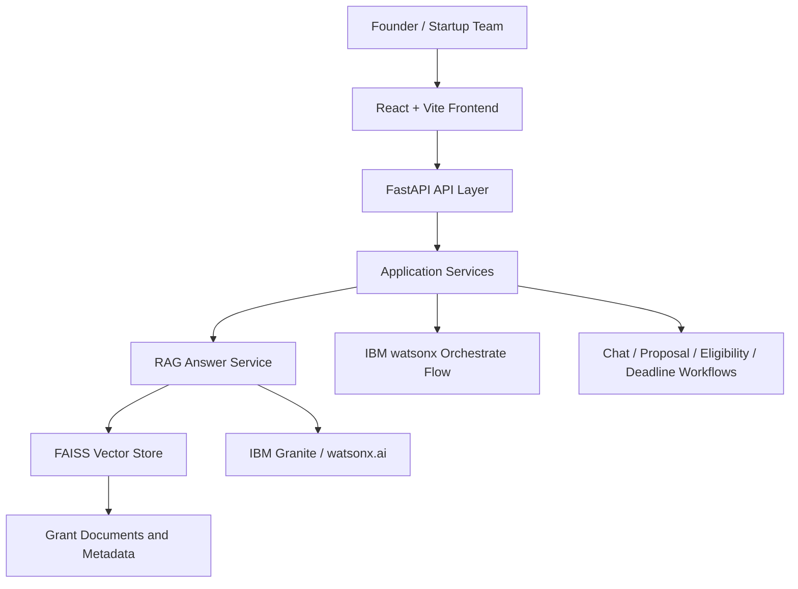

# GrantAI
### AI-Powered Government Grant Recommendation & Proposal Assistant for Indian Startups

[](https://www.python.org/)
[](https://fastapi.tiangolo.com/)
[](https://react.dev/)
[](https://vitejs.dev/)
[](https://www.typescriptlang.org/)
[](https://www.ibm.com/products/watsonx)
[](https://www.ibm.com/products/watsonx)
[](https://www.langchain.com/)
[](https://faiss.ai/)
[](https://railway.app/)
[](https://vercel.com/)
[](https://opensource.org/licenses/MIT)

GrantAI is a full-stack AI assistant for helping Indian startups discover relevant government grants, understand eligibility, plan deadlines, and draft proposal-ready content. The platform combines a React frontend, a FastAPI backend, retrieval-augmented generation, and IBM Granite-powered assistance with a grounded document workflow.

Startups often struggle to navigate fragmented grant information, unclear eligibility criteria, and fast-moving deadlines. GrantAI brings those workflows into one experience so founders can move from discovery to action with less manual effort.

## Overview

GrantAI is designed for:

- founders and startup teams looking for relevant public funding opportunities
- innovation and incubation teams that need a structured way to evaluate grants
- product and operations teams building proposal workflows around grant documentation

The system currently provides a conversational interface, grant recommendation flows, eligibility analysis, deadline awareness, notification suggestions, proposal drafting support, and grounded RAG-based answers backed by grant documents.

## Features

| Feature | Status |
| --- | --- |
| AI chat assistant | Implemented |
| Grant recommendation | Implemented |
| Eligibility analysis | Implemented |
| Proposal generation | Implemented |
| Deadline tracking guidance | Implemented |
| Notification support | Implemented |
| RAG-backed search | Implemented |
| Semantic retrieval | Implemented |
| IBM Granite integration | Implemented |
| IBM watsonx.ai integration | Implemented |
| FastAPI API layer | Implemented |
| React dashboard experience | Implemented |

## Tech Stack

| Layer | Technology |
| --- | --- |
| Frontend | React, Vite, TypeScript, Tailwind CSS |
| Backend | FastAPI, Uvicorn |
| AI / RAG | LangChain, FAISS, sentence-transformers, IBM Granite, IBM watsonx.ai |
| Data & retrieval | FAISS vector index, grounded prompt builder |
| Testing | pytest, FastAPI TestClient |
| Packaging | Python requirements, npm package manifests |

## Architecture



## Project Structure

```text
apps/
  api/        FastAPI backend and API routes
  web/        React + Vite frontend
backend/     RAG pipeline, embeddings, and retrieval components
data/        datasets and retrieval assets
docs/        architecture, API, and submission documentation
infra/       deployment and infrastructure assets
scripts/     ingestion, evaluation, and utility scripts
tests/       backend and API test suite
```

## Installation

### 1. Clone the repository

```bash
git clone <your-repo-url>
cd <repo-folder>
```

### 2. Create a virtual environment

On macOS / Linux:

```bash
python -m venv .venv
source .venv/bin/activate
```

On Windows PowerShell:

```powershell
py -m venv .venv
.\.venv\Scripts\Activate.ps1
```

### 3. Install Python dependencies

```bash
pip install -r requirements.txt
```

### 4. Install frontend dependencies

```bash
cd apps/web
npm install
```

### 5. Run the backend

From the repository root:

```bash
python apps/api/run.py
```

The API will be available at http://localhost:8000.

### 6. Run the frontend

```bash
cd apps/web
npm run dev
```

The frontend will be available at the local Vite URL shown in the terminal.

## Environment Variables

Copy the sample environment file and adjust values before running the application.

```bash
cp .env.example .env
```

| Variable | Description | Required |
| --- | --- | --- |
| APP_ENV | Application environment label | No |
| APP_NAME | Application name | No |
| API_BASE_URL | Frontend base URL for API calls | No |
| API_HOST | Backend host binding | Yes |
| API_PORT | Backend port binding | Yes |
| LOG_LEVEL | Uvicorn log level | No |
| JWT_SECRET | JWT signing secret | No |
| JWT_ISSUER | JWT issuer value | No |
| DATABASE_URL | Database connection string | No |
| COS_ENDPOINT | IBM Cloud Object Storage endpoint | No |
| COS_API_KEY_ID | IBM Cloud Object Storage API key | No |
| COS_INSTANCE_CRN | IBM Cloud Object Storage instance identifier | No |
| COS_BUCKET_NAME | Object storage bucket name | No |
| VECTOR_INDEX_PATH | Path for the FAISS index | No |
| EMBEDDINGS_PROVIDER | Embedding provider selection | No |
| WATSONX_API_KEY | IBM watsonx.ai API key | No |
| WATSONX_PROJECT_ID | IBM watsonx.ai project identifier | No |
| WATSONX_URL | IBM watsonx.ai endpoint | No |
| GRANITE_MODEL_ID | Granite model identifier | No |
| WATSONX_ASSISTANT_API_KEY | Watson Assistant API key | No |
| WATSONX_ASSISTANT_URL | Watson Assistant endpoint | No |
| WATSONX_ASSISTANT_ID | Watson Assistant identifier | No |
| WATSONX_ORCHESTRATE_API_KEY | Orchestrate API key | No |
| WATSONX_ORCHESTRATE_URL | Orchestrate endpoint | No |
| REDIS_URL | Optional Redis connection string | No |

## Deployment

### Frontend

The frontend is structured for deployment on Vercel.

Suggested steps:

1. Create a Vercel project for the web app in [apps/web](apps/web).
2. Set the build command to `npm run build`.
3. Configure the output directory as the Vite build output.
4. Provide `VITE_API_BASE_URL` so the UI can reach the backend API.

### Backend

The backend is structured for deployment on Railway.

Suggested steps:

1. Create a Railway service for the FastAPI application.
2. Set the startup command to `python apps/api/run.py`.
3. Configure environment variables from [.env.example](.env.example).
4. Expose the API port using the `PORT` or `API_PORT` environment variable.

## API

The backend exposes the following REST routes under `/api/v1`.

| Method | Route | Description |
| --- | --- | --- |
| GET | `/api/v1/health` | Health check endpoint |
| POST | `/api/v1/chat/turn` | Send a chat turn to the assistant |
| POST | `/api/v1/recommend` | Recommend grants based on a startup profile |
| POST | `/api/v1/proposal/generate` | Generate a proposal draft |
| PUT | `/api/v1/profile` | Upsert a user profile |
| GET | `/api/v1/history` | Retrieve chat or workflow history |
| POST | `/api/v1/eligibility/check` | Evaluate grant eligibility |
| POST | `/api/v1/deadline` | Analyze grant deadlines |
| POST | `/api/v1/notifications` | Generate notification guidance |
| POST | `/api/v1/orchestrate/execute` | Trigger orchestrated workflow execution |
| POST | `/api/v1/search` | Run a search request |
| POST | `/api/v1/workflows/unified` | Run a unified workflow |

## Screenshots

Placeholder visuals for the project landing page and key workflows:

- [docs/images/landing.png](docs/images/landing.png)
- [docs/images/chat.png](docs/images/chat.png)
- [docs/images/dashboard.png](docs/images/dashboard.png)
- [docs/images/proposal.png](docs/images/proposal.png)

## Future Improvements

Planned enhancements for the next iteration include:

- deeper workflow orchestration across grant qualification and proposal drafting
- richer analytics dashboards for grant tracking and status monitoring
- stronger document ingestion and metadata enrichment for government sources
- expanded test coverage across the RAG and proposal generation pipeline
- tighter deployment automation for Vercel and Railway

## Security

Security is handled through environment-based configuration:

- keep secrets in `.env` and never commit them to source control
- use `.env.example` as the documented template for required variables
- avoid exposing API keys, project identifiers, or tokens in logs or screenshots
- rotate service credentials regularly for IBM watsonx.ai and related integrations

## Performance

The current codebase already uses:

- FAISS for vector similarity search
- semantic retrieval for grounded document lookup
- a modular service-oriented backend structure that keeps retrieval and generation steps isolated

Runtime optimizations such as broader caching and lazy-loading patterns are not yet the primary focus of the current implementation.

## Contributing

Contributions are welcome.

1. Fork the repository.
2. Create a feature branch.
3. Make focused changes with tests where possible.
4. Run the relevant test suite before opening a pull request.
5. Document notable behavior changes in the relevant docs.

## License

This project is distributed under the MIT License.

## Acknowledgements

This project builds on the work of:

- IBM watsonx.ai
- IBM Granite
- LangChain
- FAISS
- FastAPI
- React
- Railway
- Vercel

## Live Demo

- Frontend: Coming soon
- Backend API: Coming soon
- Documentation: [docs](docs)

---

Built with ❤️ using IBM watsonx.ai, IBM Granite, FastAPI, React, and LangChain.

